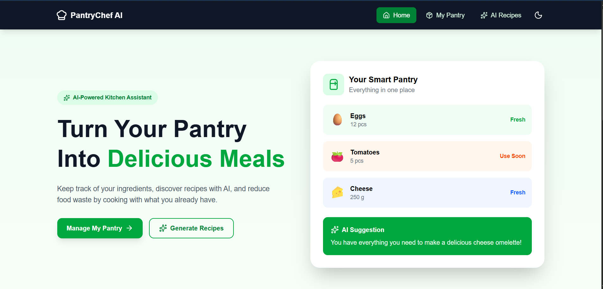
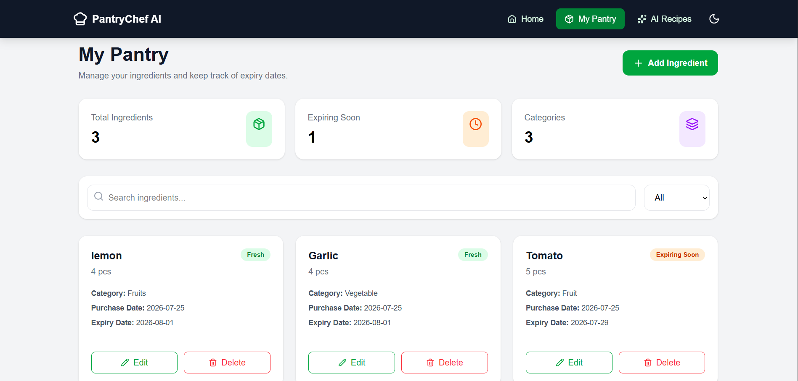
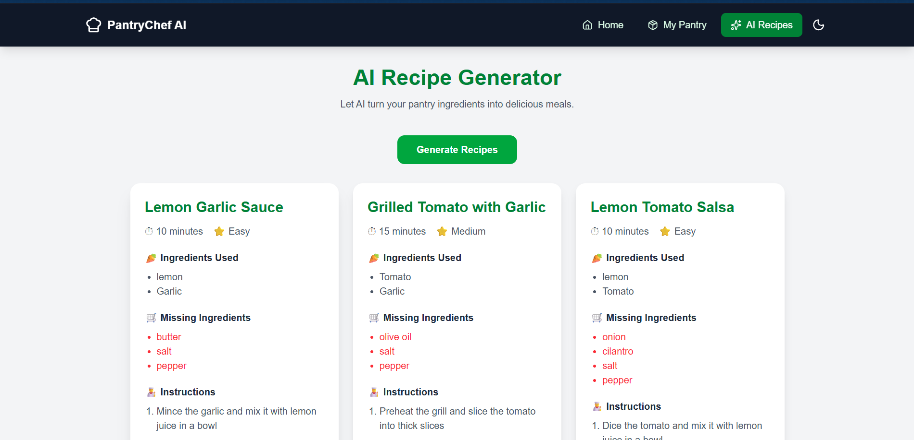
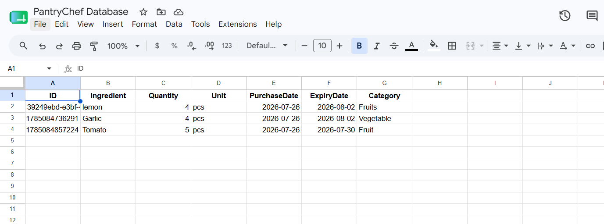

# 🍳 PantryChef AI

> An AI-powered pantry management and recipe recommendation application that helps users manage their ingredients, reduce food waste, and discover delicious recipes based on what they already have.

## 🌐 Live Demo

🔗 **Live Application:** pantrychef-ai-cyan.vercel.app

🔗 **GitHub Repository:** [https://github.com/Laraib-Hash/pantrychef-ai](https://github.com/Laraib-Hash/pantrychef-ai)

---

# 📌 1. About the Project

PantryChef AI is a web application designed to solve a common problem faced by students, busy individuals, and households: **forgetting what ingredients they already have and not knowing what to cook with them**.

People often purchase groceries and later forget about them. Some ingredients may expire before they are used, while users may continue buying new groceries unnecessarily.

PantryChef AI provides a simple solution by allowing users to:

- Keep track of pantry ingredients.
- Record ingredient quantities.
- Track purchase and expiry dates.
- Organize ingredients by category.
- Identify ingredients that may expire soon.
- Search and manage pantry items.
- Get AI-powered recipe recommendations based on available ingredients.
- See which ingredients are available and which are missing.
- Get step-by-step cooking instructions.
- Receive AI-generated tips for reducing food waste.

The application uses **Google Sheets as a lightweight cloud database** and **Groq AI** to generate personalized recipe recommendations.

---

# 🎯 2. Problem Statement

Many students and households face the following problems:

- They forget which ingredients they already have.
- Food expires because it is not used on time.
- They struggle to decide what to cook.
- They buy duplicate groceries unnecessarily.
- They waste food because they do not have recipe ideas.

PantryChef AI addresses these problems by combining **pantry management** with **AI-powered recipe recommendations**.

Instead of asking:

> "What should I cook today?"

The user can simply manage their pantry and let PantryChef AI answer:

> "What can I make with the ingredients I already have?"

---

# 💡 3. Solution

PantryChef AI allows users to create a digital inventory of their pantry.

For each ingredient, users can store information such as:

- Ingredient name
- Quantity
- Unit
- Purchase date
- Expiry date
- Category

The application retrieves this information from Google Sheets.

When the user wants recipe ideas, PantryChef AI sends the available ingredients to an AI-powered backend API. The AI analyzes the pantry ingredients and generates recipes that prioritize ingredients the user already owns.

Each recipe includes:

- Recipe name
- Estimated cooking time
- Difficulty level
- Ingredients available in the pantry
- Missing ingredients
- Step-by-step cooking instructions
- Food waste reduction tips

---

# ✨ 4. Features

## 🏠 Home Page

The home page introduces PantryChef AI and explains how the application helps users manage their pantry and discover recipes.

---

## 🥕 Pantry Management

Users can add ingredients to their digital pantry.

Each ingredient can contain:

- Ingredient name
- Quantity
- Unit
- Purchase date
- Expiry date
- Category

The information is stored in Google Sheets and accessed through a Google Apps Script Web API.

---

## 📊 Pantry Dashboard

The application provides an overview of the user's pantry and its ingredients.

Users can quickly view their stored pantry items and manage their inventory.

---

## 🔍 Search and Filtering

Users can search through their pantry ingredients and organize items based on categories.

This makes it easier to find specific ingredients.

---

## ⏰ Expiry Tracking

Users can store expiry dates for ingredients.

This helps users identify ingredients that need to be used soon and encourages them to consume food before it expires.

---

## 🤖 AI Recipe Generator

PantryChef AI uses artificial intelligence to generate personalized recipe recommendations.

The AI analyzes the ingredients available in the user's pantry and recommends recipes based on those ingredients.

For example, if the pantry contains:

- Eggs
- Bread
- Chicken
- Cheese
- Tomatoes

The AI may recommend:

- Chicken Cheese Sandwich
- Cheese Omelette
- Chicken Toast

---

## 🥕 Ingredients Used

Each AI-generated recipe displays the ingredients that are already available in the user's pantry.

This helps users understand which ingredients they can use immediately.

---

## 🛒 Missing Ingredients

The AI also identifies ingredients that are not currently available in the pantry.

This allows users to understand what additional ingredients they may need to purchase.

---

## 👨‍🍳 Cooking Instructions

Each generated recipe includes step-by-step instructions to help users prepare the meal.

---

## ♻️ Waste Reduction Tips

The AI provides suggestions for reducing food waste and prioritizing ingredients that may need to be used soon.

---

# 🤖 5. AI Feature

The main AI feature of PantryChef AI is the **AI Recipe Generator**.

The system receives a list of ingredients from the user's pantry and sends them to the AI backend.

The AI then generates exactly three recipe recommendations.

The AI is instructed to:

1. Prioritize ingredients already available in the pantry.
2. Recommend practical recipes.
3. Identify ingredients used from the pantry.
4. Identify missing ingredients.
5. Provide estimated cooking time.
6. Provide recipe difficulty.
7. Provide step-by-step instructions.
8. Provide food waste reduction suggestions.
9. Return structured JSON data so the frontend can display the results.

---

# 🧠 AI System Prompt

The following instructions are used to guide the AI recipe generation:

```text
You are PantryChef AI, a helpful cooking assistant.

The user has a list of ingredients available in their pantry.

Your task is to recommend exactly 3 recipes that the user can make using their available ingredients.

Prioritize recipes that use the ingredients the user already has.

For each recipe provide:

1. Recipe name
2. Estimated cooking time
3. Difficulty level
4. Ingredients from the pantry that are used
5. Ingredients that are missing
6. Step-by-step cooking instructions
7. A waste reduction tip

Return ONLY valid JSON.

The response must follow exactly this structure:

[
  {
    "name": "Recipe Name",
    "time": "20 minutes",
    "difficulty": "Easy",
    "ingredientsUsed": [
      "Eggs",
      "Bread"
    ],
    "missingIngredients": [
      "Butter"
    ],
    "instructions": [
      "Step 1",
      "Step 2",
      "Step 3"
    ],
    "wasteTip": "Use ingredients that are closest to their expiry date first."
  }
]

Do not include markdown.
Do not include code fences.
Do not include any explanation outside the JSON.  
```


# 🛠️ 7. Technologies and Tools Used
Frontend
React — Used to build the interactive user interface.
Vite — Used as the frontend build tool and development server.
JavaScript — Used for application logic.
Tailwind CSS — Used for responsive styling and UI design.
React Router — Used for navigation between application pages.
Lucide React — Used for interface icons.
Database
Google Sheets — Used as a lightweight cloud-based database for storing pantry ingredients.
Google Apps Script — Used to create a Web API that connects the React application with Google Sheets.
Artificial Intelligence
Groq API — Used to access the AI model for recipe generation.
Llama AI Model — Used to analyze pantry ingredients and generate recipe recommendations.
Backend
Vercel Serverless Functions — Used as a backend API layer for communicating with the Groq API.
Deployment and Version Control
Git — Used for version control.
GitHub — Used to host the public source code repository.
Vercel — Used to deploy the application publicly.
Development
Visual Studio Code — Used as the primary development environment.
🏗️ 8. System Architecture

PantryChef AI uses a simple architecture consisting of a React frontend, Google Sheets database, Google Apps Script API, Vercel serverless backend, and Groq AI.

                         ┌─────────────────┐
                         │      User       │
                         └────────┬────────┘
                                  │
                                  ▼
                         ┌─────────────────┐
                         │  React Frontend │
                         │      Vite       │
                         └────────┬────────┘
                                  │
                   ┌──────────────┴──────────────┐
                   │                             │
                   ▼                             ▼
          ┌─────────────────┐          ┌─────────────────┐
          │ Google Apps     │          │ Vercel          │
          │ Script Web API  │          │ Serverless API  │
          └────────┬────────┘          └────────┬────────┘
                   │                            │
                   ▼                            ▼
          ┌─────────────────┐          ┌─────────────────┐
          │ Google Sheets   │          │    Groq API     │
          │    Database     │          │   AI Model      │
          └─────────────────┘          └─────────────────┘
Pantry Data Flow
The user adds an ingredient through the PantryChef AI frontend.
The frontend sends the ingredient data to the Google Apps Script Web API.
Google Apps Script receives the request.
The ingredient is added as a new row in Google Sheets.
The frontend retrieves the stored ingredients through the API.
Users can view and manage their pantry data.
AI Recipe Data Flow
The user opens the AI Recipe Generator.
The application retrieves the pantry ingredients.
The ingredient names are extracted from the pantry data.
The frontend sends the ingredients to the Vercel serverless API.
The serverless API securely communicates with Groq.
The AI analyzes the available ingredients.
The AI generates three recipe recommendations.
The API returns structured recipe data.
The React frontend displays the recipes to the user.
# 📁 9. Project Structure
pantrychef-ai/
│
├── api/
│   └── recipes.js
│
├── public/
│
├── screenshots/
│   ├── home.png
│   ├── pantry.png
│   ├── ai-recipes.png
│   └── google-sheet.png
│
├── src/
│   ├── assets/
│   │
│   ├── components/
│   │
│   ├── pages/
│   │   ├── Home.jsx
│   │   ├── Pantry.jsx
│   │   └── AIRecipes.jsx
│   │
│   ├── services/
│   │   ├── googleSheet.js
│   │   └── groq.js
│   │
│   ├── App.jsx
│   ├── main.jsx
│   └── index.css
│
├── .gitignore
├── README.md
├── index.html
├── package.json
├── package-lock.json
└── vite.config.js

Note: If your actual project structure is different, update this section to match your real folders and files.

# 📸 10. Screenshots

Screenshots demonstrate the main features of PantryChef AI.

🏠 Home Page

The PantryChef AI home page introduces the application and explains how it helps users manage their pantry and discover recipes.


🥕 Pantry Management

The pantry page allows users to add and manage their available ingredients.


🤖 AI Recipe Generator

The AI Recipe Generator creates personalized recipe recommendations using the ingredients stored in the user's pantry.


📊 Google Sheets Database

Google Sheets is used as the cloud-based data store for pantry ingredients.


# 🔐 11. Environment Variables

The Groq API key is stored securely using environment variables.

Create a .env file in the root directory of the project:

GROQ_API_KEY=your_groq_api_key

The .env file is included in .gitignore and is not committed to the public GitHub repository.

For production deployment, the GROQ_API_KEY environment variable is configured through the Vercel project settings.

Security Note: Never commit API keys, passwords, or other secrets to GitHub.

# 📊 12. Google Sheets Database Setup

PantryChef AI uses Google Sheets as a simple cloud database.

A Google Apps Script Web API connects the application with Google Sheets.

The Web API provides the following operations:

GET Request

The doGet() function retrieves ingredient records from Google Sheets and returns them as JSON.

POST Request

The doPost() function receives ingredient information from the frontend and adds it as a new row in the Google Sheet.

The stored ingredient information includes:

ID
Ingredient
Quantity
Unit
Purchase Date
Expiry Date
Category

The Google Apps Script Web App is configured to execute as the application owner and is accessible to the PantryChef AI application.

# 🚀 13. How to Run the Project Locally
Step 1: Clone the Repository
git clone https://github.com/Laraib-Hash/pantrychef-ai.git
Step 2: Navigate to the Project
cd pantrychef-ai
Step 3: Install Dependencies
npm install
Step 4: Configure Environment Variables

Create a .env file in the root directory:

GROQ_API_KEY=your_groq_api_key

Do not commit this file to GitHub.

Step 5: Start the Development Server
npm run dev

The application will be available at:

http://localhost:5173
# ☁️ 14. Deployment

PantryChef AI is deployed using Vercel.

The GitHub repository is connected to Vercel, allowing the application to be built and deployed as a publicly accessible web application.

The Groq API key is configured as a Vercel environment variable rather than being exposed in the frontend source code.

Production URL

https://pantrychef-ai-cyan.vercel.app

# 🧪 15. Example User Workflow

A typical user can use PantryChef AI as follows:

Step 1 — Add Ingredients

The user opens the Pantry page and adds ingredients such as:

Eggs
Bread
Chicken
Cheese
Tomatoes
Step 2 — Store Pantry Data

The ingredient information is sent to the Google Apps Script API and stored in Google Sheets.

Step 3 — Manage Pantry

The user can view, search, edit, or delete ingredients as needed.

Step 4 — Open AI Recipes

The user navigates to the AI Recipe Generator.

Step 5 — Generate Recipes

The application retrieves the available pantry ingredients and sends them to the AI backend.

Step 6 — Receive Recommendations

The AI generates three recipe recommendations based on the user's available ingredients.

Step 7 — Cook and Reduce Waste

The user can select a recipe, check the required ingredients, follow the cooking instructions, and prioritize ingredients that may expire soon.

# 🎯 16. Benefits

PantryChef AI helps users:

Save time deciding what to cook.
Keep track of pantry ingredients.
Make better use of groceries they already purchased.
Reduce unnecessary duplicate purchases.
Discover new recipes.
Identify missing ingredients.
Reduce food waste.
Use ingredients before they expire.
Make meal decisions based on ingredients they already have.
# 🔮 17. Future Improvements

Potential future improvements include:

User authentication and individual pantry accounts.
Push notifications for ingredients approaching their expiry date.
Automatic shopping list generation.
Recipe image generation.
Nutritional information and calorie tracking.
Dietary preference support.
Vegetarian and vegan recipe filters.
Allergy-aware recipe recommendations.
Voice-based ingredient input.
Barcode scanning for grocery items.
Mobile application.
Personalized recipe recommendations based on user preferences.
Integration with grocery delivery services.
Recipe history and favorites.
AI-powered weekly meal planning.
# ⚠️ 18. Limitations

The current version of PantryChef AI has some limitations:

Google Sheets is used as a lightweight database rather than a traditional production database.
The application currently does not provide individual user accounts.
Recipe recommendations depend on the AI model's generated responses.
AI-generated recipes should be reviewed by users before cooking, especially for dietary restrictions and allergies.
Expiry dates depend on the information entered by the user.
The application requires an active internet connection to communicate with the Google Sheets API and AI service.
The free usage limits of third-party AI services may affect the availability of AI recipe generation.
# 🔒 19. Security

The application follows basic security practices:

API keys are stored using environment variables.
The .env file is excluded from Git.
The Groq API key is not directly exposed in the React frontend.
Production AI requests are handled through a serverless backend API.
Sensitive credentials are not included in the public GitHub repository.
Environment variables are configured separately in the Vercel deployment environment.
# 🎓 20. Project Purpose

PantryChef AI was developed as an individual final AI application project to demonstrate the practical use of:

Modern frontend development.
Cloud-based data storage.
REST-style APIs.
Serverless backend functions.
Generative AI.
Prompt engineering.
AI-powered recommendations.
Cloud deployment.
Git and GitHub version control.

The project demonstrates how AI can be integrated into a practical application to solve an everyday problem.

# 👩‍💻 21. Author

Laraib Zahra

Computer Science Student

GitHub:

https://github.com/Laraib-Hash/pantrychef-ai

📄 22. License

This project was developed as an individual final project for educational purposes.
